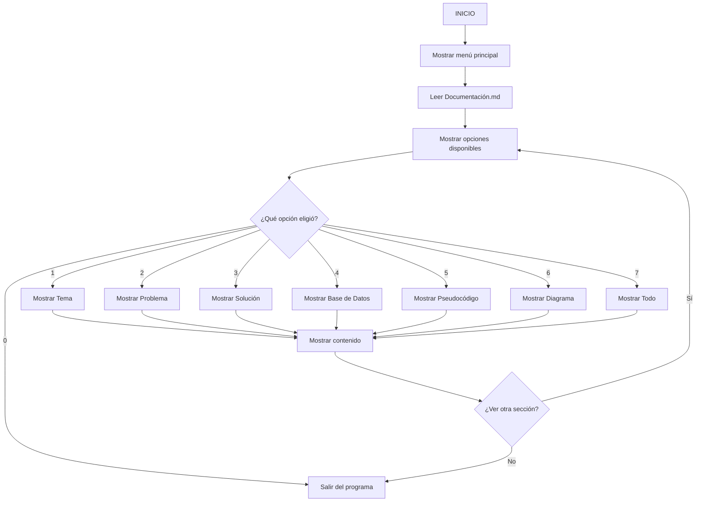

# Proyecto Aurelion: Optimización de ventas y comportamiento de clientes

**Autor:** Daisy Geraldine Chipana Lapa  
**Fecha:** Octubre 2025

---

## 1. Tema
Optimización de ventas y comportamiento de clientes usando análisis de datos

## 2. Problema
Toda la informacion de la tienda Aurelion se registra en 4 archivos excel, como las ventas, los clientes, los productos y el detalle de estos.  

El kiosko no cuenta con un sistema que le permita analizar fácilmente la información de ventas, productos y clientes.
- Qué productos se venden más o menos
- En qué horarios hay más ventas
- Qué clientes compran con mayor frecuencia

## 3. Solución Propuesta
Desarrollar un programa en Python que lea los archivos Excel con los datos del kiosko y realice un análisis automático. Además, el programa podrá mostrar su propia documentación (tema, pasos, pseudocódigo) de forma interactiva.

### Herramientas a Utilizar
- **Análisis:** Python, Pandas
- **Base de datos:** MySQL
- **Visualización:** Power BI

---

## 4. Base de Datos Actual (Archivos Excel)
**Total de archivos:** 4 archivos Excel
**Relaciones:** Hay relación entre las 4 tablas por su id.

### Tablas (Archivos Excel)

#### Tabla 1: clientes.xlsx
- **Contenido:** Almacena la información de los clientes
- **Campos principales:** id_cliente, nombre_cliente, email, ciudad, fecha_alta
- **Tipos de datos:** int, str, str, str, date
- **Escala:** Mensual 
- **Registros aprox:** 100 filas
- **Relación:** No hay relacion

#### Tabla 2: detalle_ventas.xlsx
- **Contenido:** Almacena la información de todas las ventas realizadas.
- **Campos principales:** id_venta, id_producto, nombre_producto, cantidad, precio_unitario, importe
- **Tipos de datos:** int, str, str, str, date
- **Escala:** diario
- **Registros aprox:** 343 filas
- **Relación:** Con la tabla ventas y productos.

#### Tabla 3: productos.xlsx
- **Contenido:** Almacena información de los productos.
- **Campos principales:** id_producto, nombre_producto, categoria, precio_unitario
- **Tipos de datos:** int, str, str, float
- **Escala:** Constante
- **Registros aprox:** 100 filas
- **Relación:** No hay relacion

#### Tabla 4: ventas.xlsx
- **Contenido:** Almacena todas las ventas del negocio.
- **Campos principales:** id_venta, fecha, id_cliente, nombre_cliente, email, medio_pago.
- **Tipos de datos:** int, date, int, str, str, str.
- **Escala:** Diario
- **Registros aprox:** 120 filas
- **Relación:** Con la tabla clientes.

## 5. Pseudocódigo
INICIO
  Mostrar menú
  Leer Documentacion.md
  Permitir elegir secciones
  Mostrar contenido seleccionado
FIN

## 6. Diagrama del flujo

